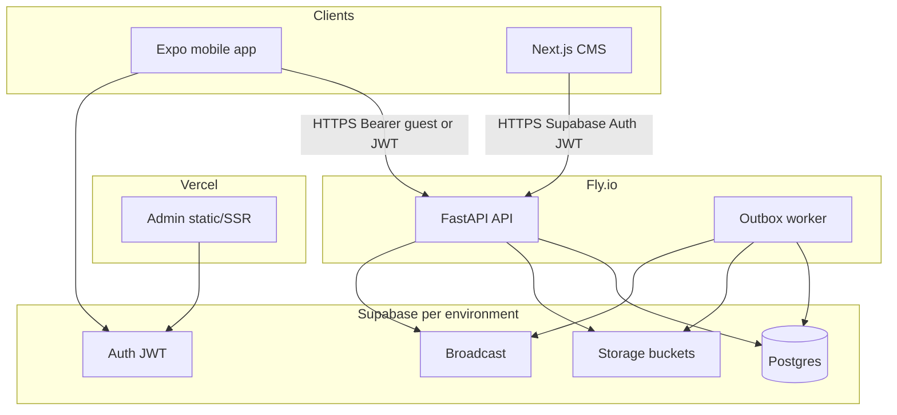

# Production deployment architecture

Playbyte production runs as **separate deployable units** sharing one Supabase project per environment.

## Architecture diagram

## Component placement

| Component | Platform | Notes |
|-----------|----------|-------|
| **API** | Fly.io (or similar) | `uvicorn app.main:app --host 0.0.0.0 --port 8000` |
| **Worker** | Fly.io separate process/machine | `python -m worker.main` — same env as API, no HTTP port |
| **Database** | Supabase Postgres | Migrations in `supabase/migrations/` |
| **Auth** | Supabase Auth | JWT validated by API; anon key in mobile/admin only |
| **Storage** | Supabase Storage | Share cards (public), avatars (public), exports (private + signed URL) |
| **Admin CMS** | Vercel | `NEXT_PUBLIC_*` only; Supabase Auth + `admin_users` |
| **Mobile** | EAS Build | `EXPO_PUBLIC_*` only; no service role |
| **Monitoring** | Sentry + uptime | `/health` liveness, `/ready` DB check |

## Environment isolation

| Resource | Development | Staging | Production |
|----------|-------------|---------|------------|
| Supabase project | Local Docker or dev project | **Separate** staging project | **Separate** production project |
| Secrets | `.env` (gitignored) | Fly/Vercel/EAS secret stores | Fly/Vercel/EAS secret stores |
| `APP_ENV` | `development` | `staging` | `production` |
| Admin dev API key | Allowed locally | Disabled | **Blocked** (JWT + `admin_users` only) |
| Storage | Local filesystem fallback | Supabase Storage | Supabase Storage |

Never share production database credentials with staging or development.

## Secrets storage (production)

| Secret | Where stored | Used by |
|--------|--------------|---------|
| `DATABASE_URL` | Fly secrets | API, worker |
| `SUPABASE_SERVICE_ROLE_KEY` | Fly secrets only | API, worker |
| `SUPABASE_JWT_SECRET` | Fly secrets | API |
| `GUEST_TOKEN_SECRET` | Fly secrets | API |
| `ADMIN_API_KEY` | Fly secrets (automation only; not used by CMS in prod) | CI/smoke scripts |
| `NEXT_PUBLIC_SUPABASE_ANON_KEY` | Vercel env | Admin |
| `EXPO_PUBLIC_SUPABASE_ANON_KEY` | EAS secrets | Mobile build |

**Never** put `SUPABASE_SERVICE_ROLE_KEY` in mobile, admin, or Git.

## Health checks

| Endpoint | Purpose | Exposure |
|----------|---------|----------|
| `GET /health` | Liveness — process up | Public, minimal `{ "ok": true }` |
| `GET /ready` | Readiness — DB reachable | Public, `{ "ok": true, "database": "up" }` |

Configure Fly/Vercel/uptime monitors against `/health`. Use `/ready` before traffic shift.

## Storage buckets

Applied via `supabase/migrations/0002_storage.sql`:

| Bucket | Public read | Write | Max size |
|--------|-------------|-------|----------|
| `share-cards` | Yes | API (service role) | 2 MB PNG |
| `avatars` | Yes | API (service role) | 2 MB image |
| `exports` | No (signed URL) | Worker (service role) | 10 MB JSON |

## Deployment artifacts

- `backend/Dockerfile` — API container
- `backend/fly.toml.example` — Fly.io template (copy and customize)
- `apps/mobile/eas.json` — EAS build profiles
- `docs/deployment-runbook.md` — step-by-step deploy sequence

## What this document does not cover

- Store submission (iOS/Android) — prepare builds only
- Automatic production promotion — requires explicit approval
- Load testing at 100k concurrent — not verified for MVP
